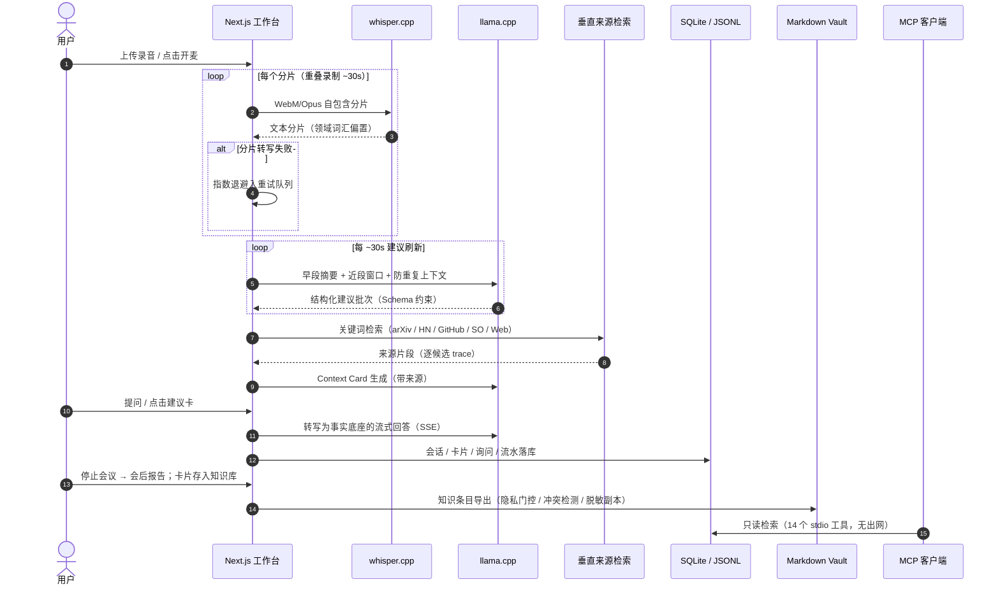

<div align="center">

# CueMind

**会中予言，会后成识** — 本地优先的会议 AI 副驾

[](https://nextjs.org)
[](https://react.dev)
[](https://www.typescriptlang.org)
[](https://tailwindcss.com)
[](https://www.sqlite.org)
[](https://github.com/ggml-org/whisper.cpp)
[](https://github.com/ggml-org/llama.cpp)
[](https://www.electronjs.org)
[](https://modelcontextprotocol.io)

</div>

---

## 📖 项目简介

CueMind 是一个本地优先的会议 AI 副驾：开会时把录音（或麦克风）实时转写成文字，每约 30 秒产出一批结构化现场建议；每个建议可以点开成**带来源的上下文卡片**（关键词检测 → arXiv / Hacker News / GitHub / Stack Overflow 垂直检索 → 通用 Web 兜底 → 逐候选溯源的中文解释卡）；会中可随时以转写为事实底座追问；停止会议自动生成决策 / 行动项 / 跟进清单报告。

沉淀不止于此。会中卡片可一键存入本地知识库（SQLite + JSONL fallback 双后端），在 `/knowledge` 三栏管理页检索、编辑、归档；知识条目可导出为 Markdown Vault（frontmatter 元数据 + 外部编辑冲突检测），并通过一个本地只读 MCP server 暴露给任意 MCP 客户端做知识检索。

项目重点不在于简单调用模型，而是围绕浏览器 MediaRecorder 分片的容器头问题、转写失败恢复、上下文窗口策略（摘要 vs 截断）、隐私分级与出站闸门，搭了一条可观察、可回放的处理链路（pipeline-events 流水 + replay 回放）。

**本地优先**：音频、转写、推理全部留在本机（whisper.cpp + llama.cpp）；联网检索是唯一的出站调用，且每个回答带来源可回溯；远端 OpenAI-compatible API 是显式配置的备选项，没有静默云默认。数据目录由 `CUEMIND_DATA_DIR` 决定，转写、卡片与原始音频从不外传。

## ✨ 核心功能

- **实时转写**：双 MediaRecorder 重叠录制（~30s 自包含分片）→ whisper.cpp 本地转写；失败分片指数退避重试、静默跳过空分片、可暂停续录，电平表实时可见
- **现场建议**：早段摘要 + 近段窗口双层上下文，五种建议标签（question / talking_point / answer / fact_check / clarify），JSON Schema 约束输出 + 上一批建议做防重复回路；卡片可置顶、忽略、评分
- **来源式上下文卡片**：关键词检测 → 垂直来源检索（arXiv / Hacker News / GitHub / Stack Overflow）→ 通用 Web 兜底 → 带来源解释卡，逐候选 trace，来源点击可溯
- **会后报告与追问**：决策 / 行动项 / 跟进清单三段式报告，转写搜索与时间戳让长会可扫读；SSE 流式问答，转写作为独立 system 块锚定事实
- **知识库沉淀**：卡片一键入库（最小编辑表单），bigram 检索，乐观锁并发编辑，归档 / 恢复 / 软删
- **Vault 同步与冲突检测**：知识条目导出 Markdown（`<vaultRoot>/cuemind/knowledge/<slug>.md`），幂等重导出；检测到 CueMind 之外的文件编辑即阻断自动覆盖并标记冲突，用户显式确认才覆盖
- **隐私状态机**：`clear / redacted / privacy_uncertain / blocked` 四态；SECRET 命中即阻断出站，`privacy_uncertain` 需人工复审，`redacted` 条目导出脱敏副本而库内原文不动；blocked 条目对 MCP 等同不存在
- **会话隔离与安全**：会话令牌鉴权（`X-Session-Id` / `X-Session-Token`）、请求体大小上限、每路由 IP 限流、CSP 等安全响应头
- **本地桌面模式**：Electron + C#/.NET 采集助手，WASAPI loopback + 麦克风双轨采集，解决浏览器拿不到系统音频的平台限制，实现虚拟会议两向转写
- **只读 MCP server**：本地 stdio JSON-RPC，14 个知识 / 会话 / 卡片检索工具，无出网、无写操作、blocked 不可见

## 🏗️ 技术架构

系统流程：



存储契约：会话快照、候选卡片、询问记录、知识条目与流水事件统一落 `CUEMIND_DATA_DIR`；SQLite（better-sqlite3 + WAL）为主后端，JSONL 为显式 fallback（`CUEMIND_SESSION_STORE` / `CUEMIND_KNOWLEDGE_STORE`），两套后端共享同一接口与语义。检索是确定性关键词检索（bigram 分词），不依赖向量库与 Embedding。

## 🛠️ 技术栈

| 类别 | 技术 |
|---|---|
| 应用框架 | Next.js 15（App Router，Route Handlers 即 API 层）、React 19 |
| UI | Tailwind CSS 4、三栏工作台（转写 / 建议 / 对话） |
| 本地推理 | whisper.cpp（`whisper-cli` 子进程，ASR）、llama.cpp / `llama-server`（LLM，OpenAI-compatible） |
| 数据存储 | better-sqlite3（WAL）+ JSONL fallback：会话、候选、询问、知识、流水事件 |
| 检索 | 关键词 bigram 检索、arXiv / Hacker News / GitHub / Stack Overflow 垂直来源 + 通用 Web |
| 隐私与安全 | 隐私状态机 + 脱敏副本导出、会话令牌鉴权、每路由限流、CSP 响应头 |
| 桌面 | Electron + C#/.NET（NAudio，WASAPI loopback 双轨采集）、electron-builder（NSIS） |
| MCP | `@modelcontextprotocol/sdk`（本地 stdio 只读 server） |
| 部署 | Docker（模型目录只读挂载）、Vercel |
| 语言 | TypeScript 5、C# |

## 🚀 快速开始

### 1. 准备环境

- Node 18.18+
- [llama.cpp](https://github.com/ggml-org/llama.cpp)（`llama-server`，OpenAI-compatible）
- [whisper.cpp](https://github.com/ggml-org/whisper.cpp)（`whisper-cli`）+ 一个 GGML 模型
- FFmpeg（在 PATH 中，或用 `CUEMIND_FFMPEG_PATH` 指定）

### 2. 启动本地模型服务

```bash
# LLM：推荐 Qwen3-4B 档小模型做低延迟结构化输出（详细调参见 docs/deployment/qwen3-4b-llama-cpp.md）
llama-server -m Qwen3-4B-Instruct-2507-Q4_K_M.gguf --port 8082 -c 4096 --flash-attn
```

Whisper 通过 `CUEMIND_WHISPER_PATH` / `CUEMIND_WHISPER_MODEL_PATH` 指定可执行文件与模型，由应用按分片调用，无需常驻服务。

### 3. 配置环境变量

```bash
export CUEMIND_DATA_DIR="$PWD/.data"                    # 数据目录（SQLite/JSONL、流水事件）
export CUEMIND_WHISPER_PATH=/path/to/whisper-cli        # whisper.cpp 可执行文件
export CUEMIND_WHISPER_MODEL_PATH=/path/to/ggml-model.bin
export CUEMIND_VAULT_DIR="$PWD/vault"                   # 可选：知识 vault 导出根目录
export LLAMA_CPP_BASE_URL=http://127.0.0.1:8082/v1      # 可选：默认即此值
export LLAMA_CPP_MODEL=qwen3-4b-instruct
```

| 变量 | 用途 |
| --- | --- |
| `CUEMIND_DATA_DIR` | 数据目录：会话 / 卡片 / 询问 / 知识 / 流水事件，默认 `./.data` |
| `CUEMIND_WHISPER_PATH` / `CUEMIND_WHISPER_MODEL_PATH` | whisper.cpp 可执行文件与模型路径 |
| `CUEMIND_FFMPEG_PATH` | ffmpeg 路径（默认取 PATH 中的 `ffmpeg`） |
| `CUEMIND_VAD_MODEL_PATH` | 可选：VAD 模型，用于静默检测 |
| `CUEMIND_VAULT_DIR` | 知识 vault 导出根目录（Markdown + 冲突检测元数据） |
| `CUEMIND_SESSION_STORE` / `CUEMIND_KNOWLEDGE_STORE` | 存储后端：默认 sqlite；设为 `jsonl` 走 JSONL fallback |
| `LLAMA_CPP_BASE_URL` / `LLAMA_CPP_MODEL` | 本地 llama-server 根地址与模型 |

推理设置（模型地址、上下文窗口、提示词）也可在应用 Settings 里运行时调整，路由优先取请求值、回退默认值。远端 OpenAI-compatible API 是显式配置的备选 Provider，不配置就只走本地。

### 4. 启动应用

```bash
npm install
npm run dev
```

打开 `http://localhost:3000`：上传会议录音（Upload）或点击麦克风开讲；转写与建议每 ~30s 自动刷新；点开建议卡即得带来源解释卡并可流式追问；停止会议生成会后报告；卡片一键存入知识库，访问 `/knowledge` 检索、编辑与导出。

生产构建注意：`npm run build` 前必须停掉 `:3000` dev server——turbopack dev 与 next build 共写 `.next` 目录会导致产物损坏。

### 5. 桌面模式（可选，Windows 10/11 x64）

```bash
npm run helper:build   # 编译 C#/.NET 采集助手（需 .NET 8 SDK）
npm run desktop:build  # Next 构建 + Electron 打包 → NSIS 安装包
```

开发调试用 `npm run desktop:dev`。桌面模式由 Windows 助手实现系统音频（WASAPI loopback）+ 麦克风双轨采集，补齐浏览器模式下虚拟会议只能听到本地一侧的平台限制。

### 6. Docker（可选）

```bash
docker compose up -d   # :3000，模型目录挂载 ./models 只读 /models
```

### 7. 只读 MCP server（可选）

```bash
cd mcp-server && npm install && npm run build
node dist/index.js     # stdio JSON-RPC，stdout 仅协议、日志走 stderr、无出网
```

提供 14 个只读工具（会话 / 卡片 / 转写 / vault / 知识列表、详情、检索、版本、来源），可接入任意 MCP 客户端做本地知识检索；隐私 blocked 条目对 MCP 不可见。

## 📁 项目结构

```text
CueMind/
├── app/                    # Next.js App Router：页面 + API 路由
│   ├── api/                # sessions / suggestions / context-cards / ask /
│   │                       # knowledge / vault-export / pipeline-events …
│   └── knowledge/          # /knowledge 知识库管理页（三栏）
├── components/             # 三栏工作台 UI 组件
├── hooks/                  # 客户端 hooks（录音 / 上传 / 建议 / 卡片）
├── lib/                    # 业务核心：存储（SQLite+JSONL）、检索、隐私状态机、
│                           # vault 同步、会话鉴权、redaction、telemetry
├── mcp-server/             # 本地只读 stdio MCP server（14 个检索工具）
├── native/CueMind.Audio/   # C#/.NET Windows 采集助手（WASAPI loopback 双轨）
├── desktop/                # Electron 主进程与打包脚本
├── docs/                   # 设计文档、部署指南与实施计划
├── scripts/                # 回归测试脚本（tsx 直跑路由 handler）
├── fixtures/               # 固定评测夹具（检索可复现）
├── reports/                # 评测与性能报告产物
└── docker-compose.yml
```
